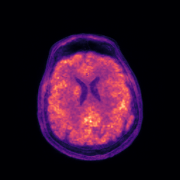
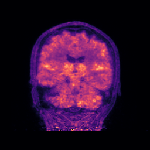

===========================================================
NiftyPET: High-throughput image reconstruction and analysis
===========================================================

|pic1| |pic2|

.. include:: highlights.rst

.. toctree::
   :maxdepth: 2
   :caption: Documentation

   intro
   install
   science

.. toctree::
   :maxdepth: 2
   :caption: Tutorials

   tutorials/demo
   tutorials/gpuaccess.rst
   tutorials/anonym.rst
   tutorials/lmproc.rst
   tutorials/basicrecon.rst
   tutorials/dynrecon.rst
   tutorials/corrqnt.rst

.. toctree::
   :maxdepth: 2
   :caption: ACR Phantom Imaging

   acr_project/intro_acr
   acr_project/rec_reg

   
.. toctree::
   :maxdepth: 2
   :caption: Open-Source Data

   data
   acr_project/acr_data

.. toctree::
   :maxdepth: 2
   :caption: Acknowledgements

   ackn

.. toctree::
   :maxdepth: 2
   :caption: Citing NiftyPET

   citing

.. toctree::
   :maxdepth: 2
   :caption: Bibliography

   zbibref